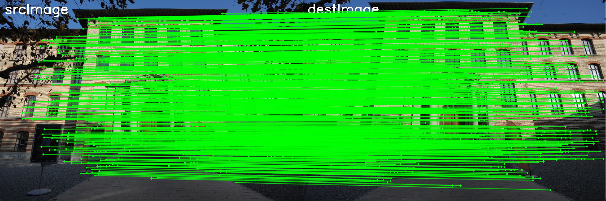
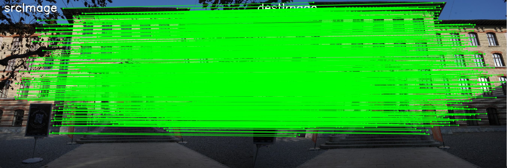

# LightGlue-OnnxRunner
## Introduction
LightGlue-OnnxRunner is a repository hosts the C++ inference code of LightGlue in ONNX format. LightGlue is a lightweight feature matcher with high accuracy and blazing fast inference. It takes as input a set of keypoints and descriptors for each image and returns the indices of corresponding points.  
* Offical Paper : *[LightGlue: Local Feature Matching at Light Speed](https://arxiv.org/pdf/2306.13643.pdf)*  
* Official Repository ：*[cvg/LightGlue](https://github.com/cvg/LightGlue)*  
* Open Neural Network Exchange (ONNX) Repository : *[fabio-sim/LightGlue-ONNX](https://github.com/fabio-sim/LightGlue-ONNX)*  

  
<p align="center">
<em>superpoint_lightglue_end2end.onnx renderings</em>
</p>  


<p align="center">
<em>disk_lightglue_end2end.onnx renderings</em>
</p>
## Attention⚠️  
Currently, the interface only supports CPU execution.The specific experimental data and equipment used are shown below. And the inferface is only supported on Windows and may encounter issues when running on Linux.

## Updates📰
- **[2023.09.08]** : LightGlueOnnxRunner supporting end-to-end model inference of SuperPoint and DISK  

## Development Enviroments🖥️
>  - Windows 11 Professional 
>  - CUDA v11.7
>  - cmake version 3.26.2

## Quick Start
### Installation
Install this repo in the following ways :  
```bash
git clone https://github.com/OroChippw/LightGlue-OnnxRunner.git
cd LightGlue-OnnxRunner
```
### Requirements⚒️
``` 
# onnxruntime-cpu 3rdparty
This repository use onnxruntime-win-x64-1.14.1
# opencv 3rdparty
This repository use opencv4.8.0
# CXX_STANDARD 17
```
### Build and Run
```
# Enter the source code directory where CMakeLists.txt is located, and create a new build folder
mkdir build
# Enter the build folder and run CMake to configure the project
cd build
cmake ..
# Use the build system to compile/link this project
cmake --build .
# If the specified compilation mode is debug or release, it is as follows
# cmake --build . --config Debug
# cmkae --build . --config Release
```
### Model Checkpoints(TODO)
### Experiment Record
Environment Device : i5-13500H + NVIDIA GeForce RTX 4060 Laptop GPU（8GB）.  
All models are available in repository *[fabio-sim/LightGlue-ONNX](https://github.com/fabio-sim/LightGlue-ONNX)*  
#### Decouple (TODO)
| Extractor Type | Model Name | Model Size(MB/GB) | CPU speed(ms) | GPU speed(ms)[TODO] | 
| :------------------:| :---------------: | :---------------: | :---------------: | :---------------: | 

#### End-to-End🌟🌟🌟
Models with the (*_flash.onnx) suffix format represent enabled Flash Attention  
| Extractor Type | Model Name | Model Size(MB/GB) | CPU speed(ms) | GPU speed(ms)[TODO] | 
| :------------------:| :---------------: | :---------------: | :---------------: | :---------------: | 
| SuperPoint | superpoint_lightglue_end2end.onnx | 50.1MB | Debug:2181ms Release: 1829ms |    | 
| SuperPoint | superpoint_lightglue_end2end_flash.onnx | 49.5MB |  |    | 
| DISK | disk_lightglue_end2end.onnx | 48.9MB | Debug:3312ms Release: 3287ms |  | 
| DISK | disk_lightglue_end2end_flash.onnx | 48.9MB |  |     | 

### License
This project is licensed under the MIT License.
